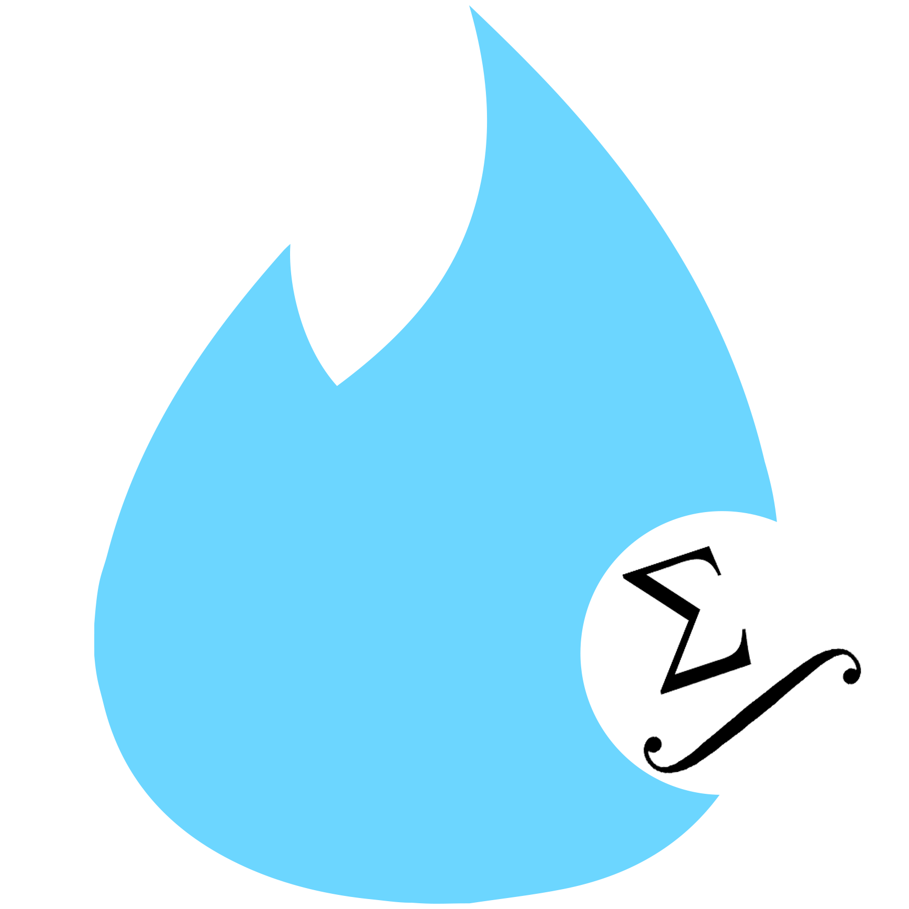
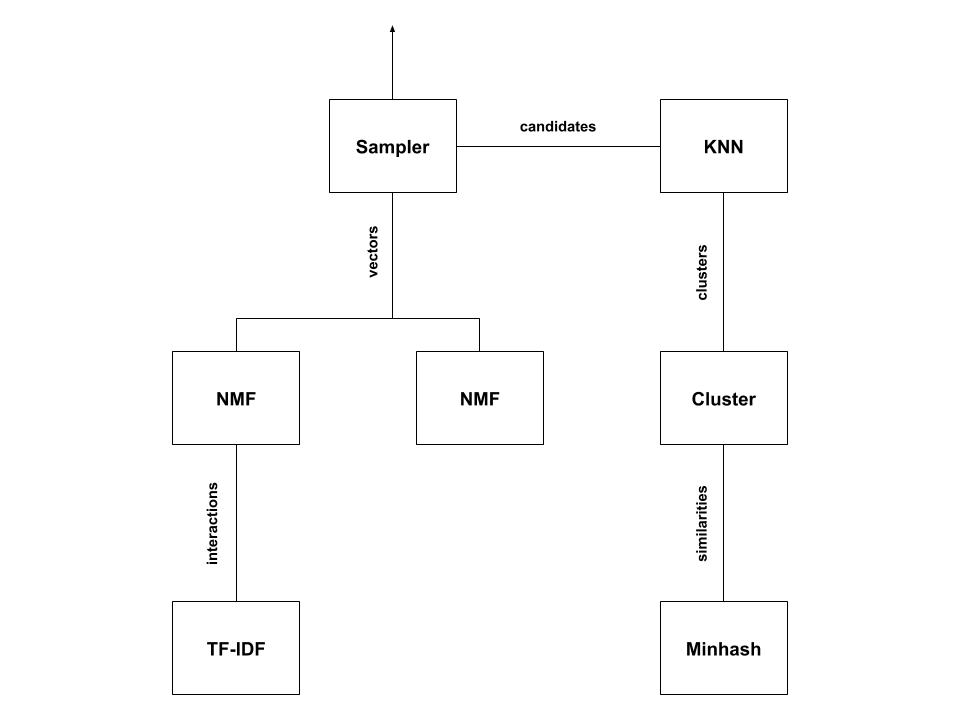

# Tinder for researchers (god knows they need it)



## Source code structure

Inside the ``src`` folder you will find the 4 main divisions of our project. The data gathering team works with ``fetching``, the data engineering, algorithms and GUI teams work respectively with ``database``, ``engine`` and ``GUI``. The ``tests`` folder contains tests for each division above.

## Architecture

### Crawler

The crawler's goal is to amass data from arxiv. We build a bipartite graph from authors and papers according to the following rule: there is an edge between an author and a paper if
1. the author published the paper
2. the author cited the paper in a publication of his

The data we must obtain from arxiv is therefore two-fold. We use the arxiv API to request author metadata for edges of type (1.). We use arxiv's S3 bucket to download PDFs _en masse_ and extract citations from the text using pattern matching.

@ghjuliasialelli
@YassineMarrakchi
@mariabenkhadra
@deivisbanys
@TotoJean
@Smakson
@ltricot

### Database

The database is subdivided in a number of storage units:
1. the academic graph as a key-value store     (custom)
2. the user/paper vectors as a key-value store (custom)
3. the user likes as a key-value store on Azure Cosmos
4. the cluster labels as a csv

@Abdelrahmansameh

### Server & API: (to come)

An API to the recommendation service.

@deivisbanys
@TotoJean
@ltricot

### Recommendation

A number of algorithms come together to produce the final recommendations. We implement the following:
1. MinHash @jjbl99
2. Label propagation for clustering @MarineHoche
3. KNN for candidate production @clemie
4. Matrix Factorization for match scoring and user/paper embedding @shrey183
5. TF-IDF for content based embedding @MarineHoche

### Putting it all together



## Documentation

### Doxygen

We use doxygen as a documentation system. It is configured to generate a ``html`` folder which essentially contains all the documentation in a format that can be explored by a web browser. Use
```
doxygen Doxyfile
```

to generate the documentation. Open the ``pages`` file inside the ``html`` in your web browser and you are set to explore the documentation.

### Commenting conventions

The template for a comment documentating a function is as follows:
```cpp
/** @brief can we build a wall?
 * 
 * @details evaluate whether the US can build a wall at the Mexican
 * border given their ambitions and budget. If the function returns
 * false, the US government shuts down.
 * 
 * @param height the height of the wanted wall in meters
 * @param budget the budget of the government in dollars
 * @return whether the government succeeds or not
 */
bool buildWall(int height, int budget) {
    if(height > 1e6 * budget) {
        // government shutdown
        return false;
    }

    return true;
}
```

The ``@brief`` tag is followed by a brief description of the function's responsobilities. The ``@details`` tag is _optional_ and should only be filled for non-trivial functions. The ``@param`` tag is followed by the name of a parameter along with its description. It is not optional. The ``@return`` tag must always be filled for non-void functions and describes the significance of the return value.

## Building

We use ``cmake`` to build our project. As of now we wish to build 4 executables:
- The crawler which will upload data to our database
- The engine responsible for the training of the recommender system
- The recommender capable of answering recommendation requests
- The GUI

Build commands:
```
git clone https://github.com/ltricot/CSE201_prototype
cd CSE201_prototype
mkdir build
cd build
cmake ..
make
```

## Running the tests

Once the build is over, inside the ``build`` folder, run
```
cd build
ctest
```

or run the test executable itself for a more detailed output. An example:
```
cd build/tests/fetching
./testcrawler
```

## Adding an executable

### How it works

``cmake`` uses ``CmakeLists.txt`` files inside each directory containing files relevant to the build process (most often source code files). Suppose you have worked on some ``work.cpp`` file which contains a ``main`` function. Suppose ``work.cpp`` includes ``oldwork.hpp``. You may append the following code to the ``CMakeLists.txt`` file in ``work.cpp``'s folder:
```
add_executable (work work.cpp oldwork.cpp)
```

to create an executable ``cmake`` will refer to as ``work``. If your work does not contain a ``main`` function, it is called a library and added to the build in the following way:
```
add_library (worklib workwithoutmain.cpp)
```

Observe we only list the ``.cpp`` files instead of the headers. If you use an external library such as ``curl``, you should manage this in the top-level ``CMakeLists.txt`` file (or the lowest level folder such that all ``.cpp`` files using the library). How cmake includes such libraries depends on its nature. You may study the ``CMakeLists.txt`` files of the project to observe how we manage external libraries. In any case, once the library is available, suppose it is store in some variable ``curl``, adding it as a dependency is as simple as:
```
target_link_libraries (work curl)
```

where ``work`` is a target (executable or even another library). Once this is added to ``CMakeLists.txt``, your ``.cpp`` files need only include curl as they always do.

### Our case

``Eigen`` is a header only library. It is included in this repository as a submodule (essentially a link to anothr git repository). The top-level ``CMakeLists.txt`` file includes it for the whole project to use, so that you need only write
```cpp
#include <Eigen/Dense>
```
at the top of your file to use the ``Dense`` part of the ``Eigen`` library.

``rapidxml`` is treated the same way but is only included for specific targets, i.e. the crawler.

``catch`` is also a header only library and is used only by the ``tests`` folder, so is included only for test targets.

``curl`` is included at the ``fetching`` level ``CMakeLists.txt`` file. It is not header only, but is well integrated with ``cmake`` so that there is no need to do anything else than ``#include`` it as you would for the 3 latter libraries.

``zlib`` is treated the same way as ``curl``.
